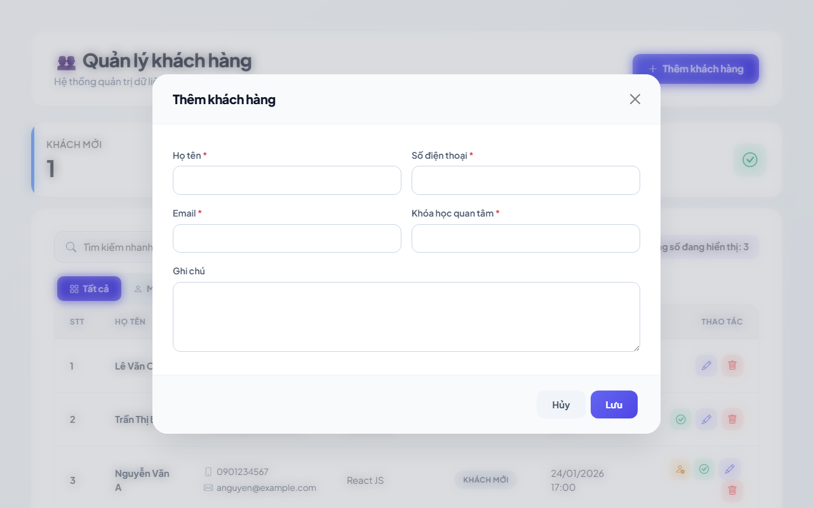
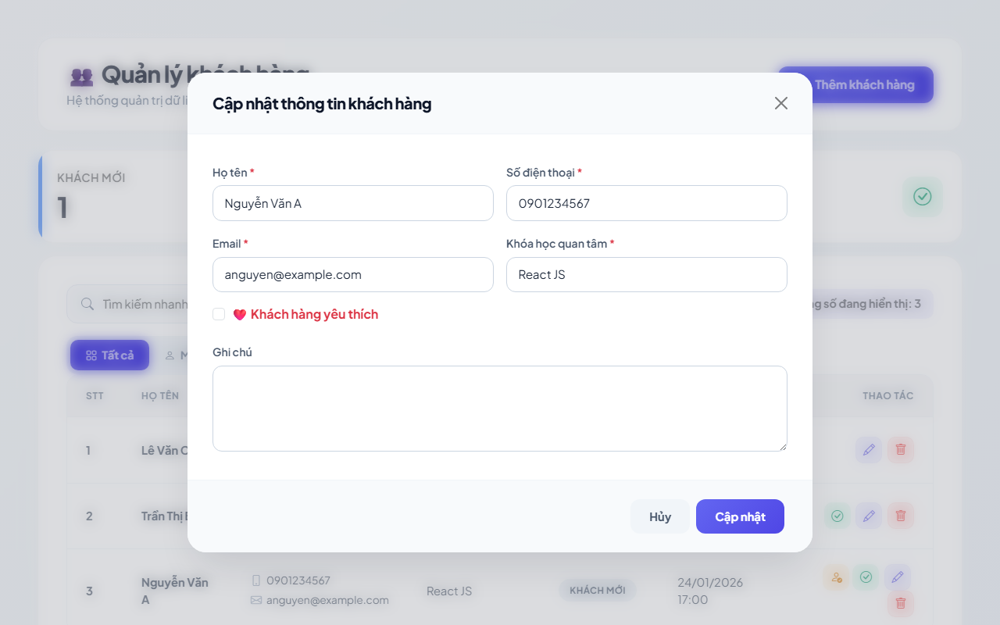
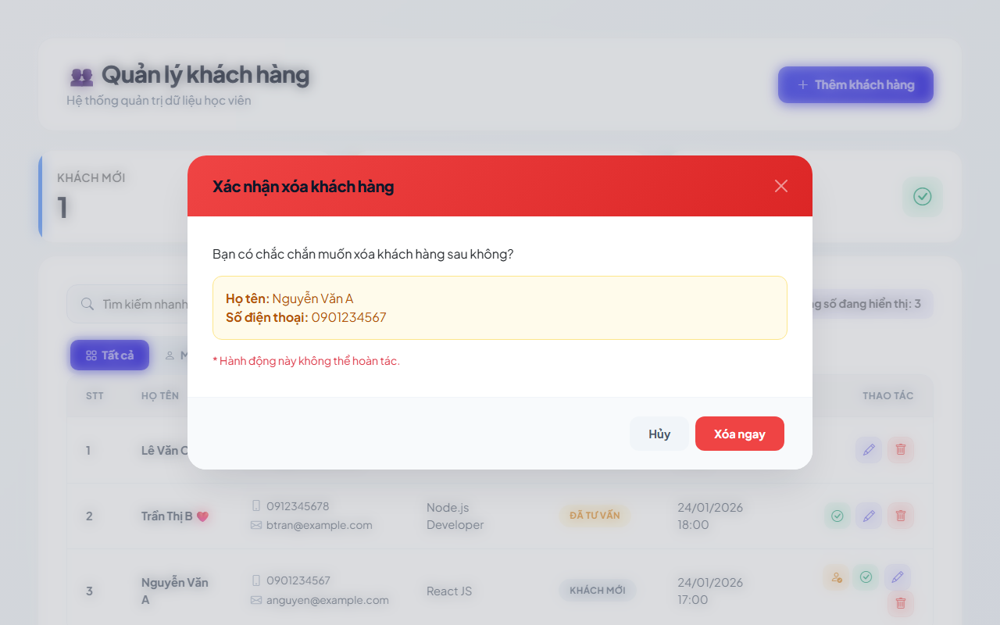
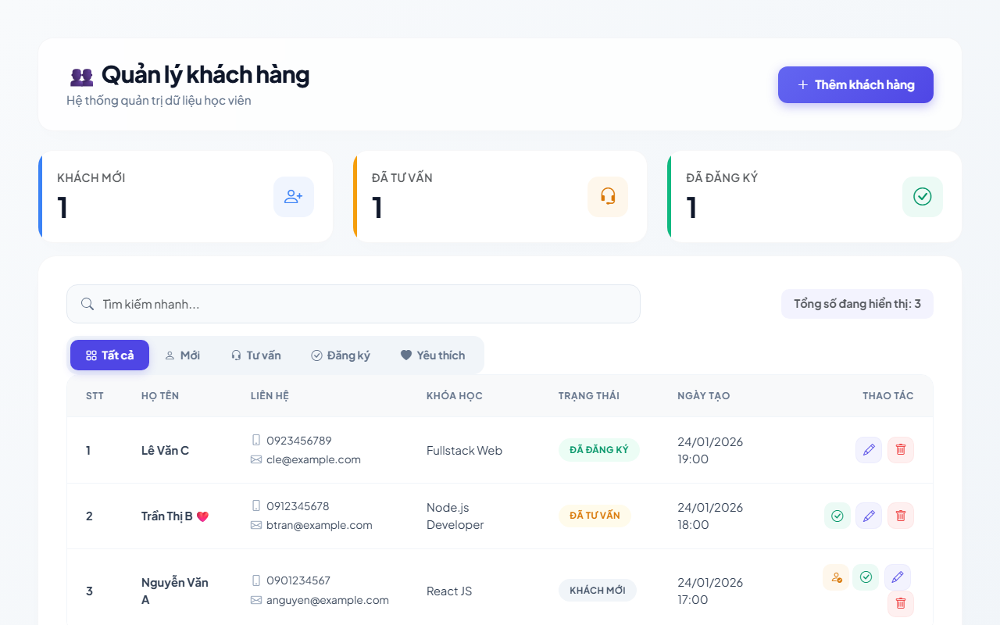
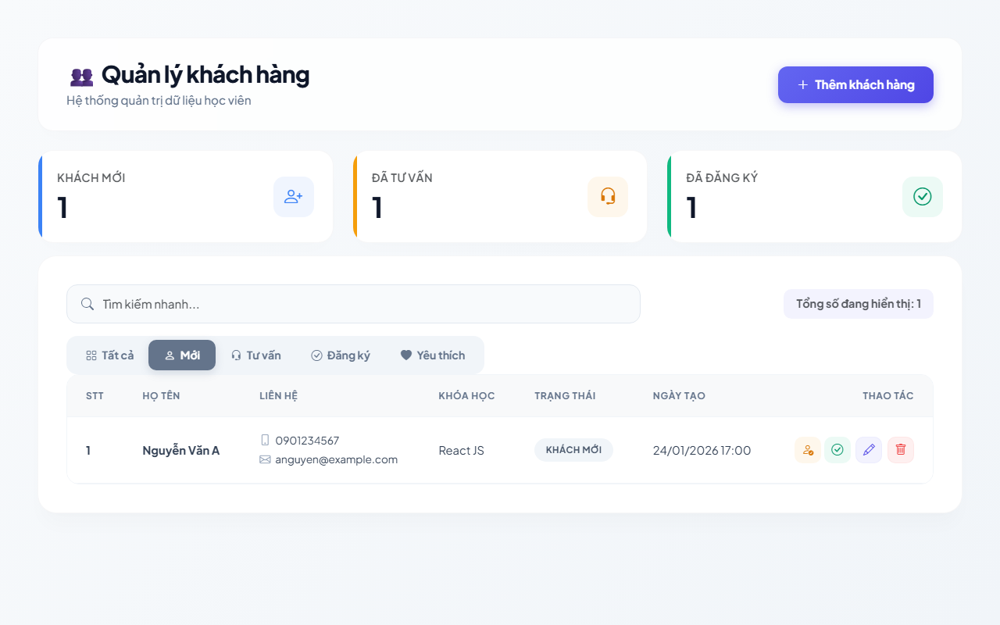
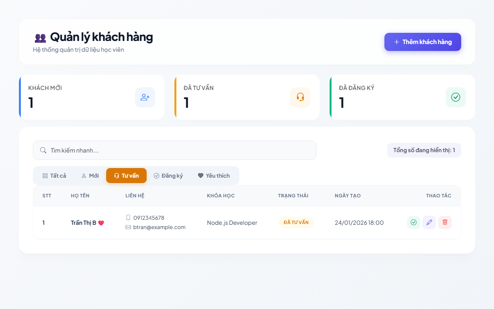
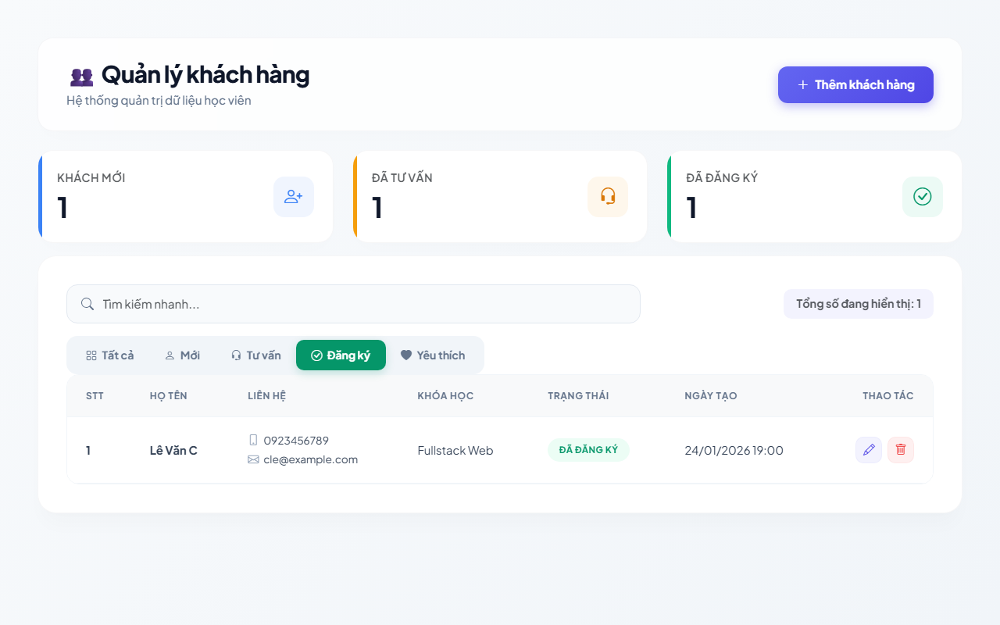
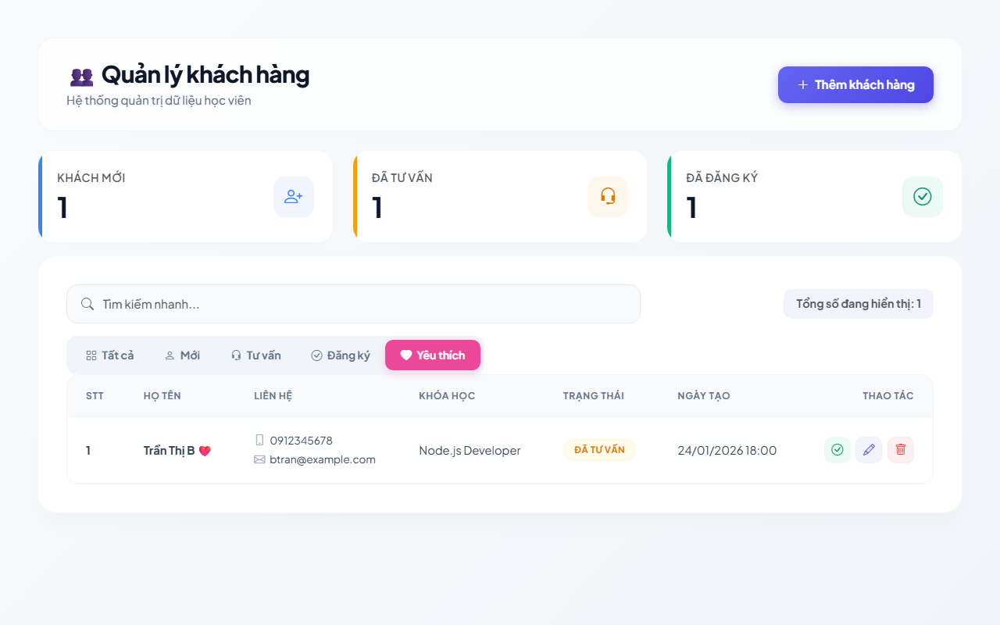
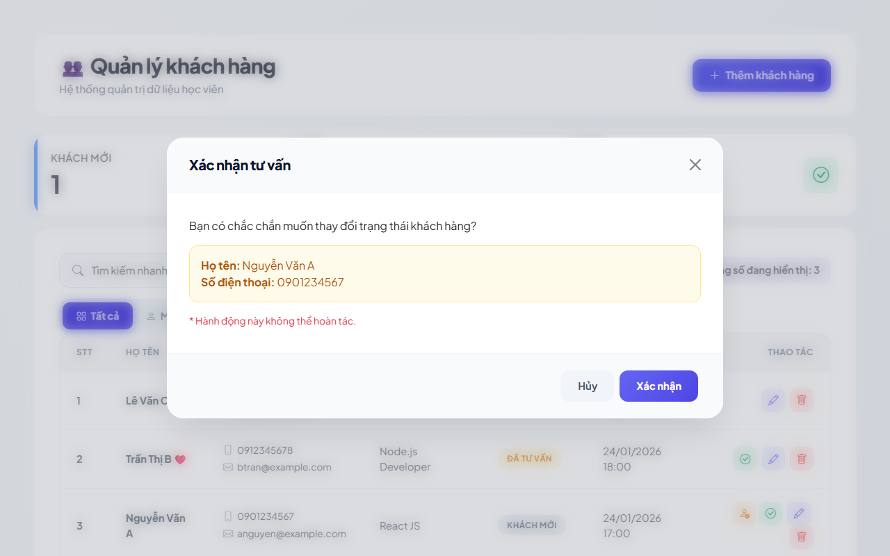

# 👥 CRM - Hệ Thống Quản Lý Khách Hàng / Học Viên

Hệ thống quản trị dữ liệu học viên & CRM Frontend hiện đại, tối ưu trải nghiệm người dùng với kiến trúc mã nguồn sạch sẽ, hiệu năng cao và được bao phủ bởi bộ kiểm thử tự động (E2E, Integration, Unit & BDD Tests) toàn diện sử dụng **Playwright** và **Vitest**.

---

## 📸 Giao diện ứng dụng đúng thực tế

### 🖥️ Màn hình chính (Dashboard)


### ➕ Thêm mới học viên



### ✏️ Cập nhật thông tin học viên



### 🗑️ Xác nhận xóa học viên



### 🔍 Tìm kiếm & Bộ lọc nâng cao

Hệ thống hỗ trợ tìm kiếm tức thời và bộ lọc động với 5 chế độ hiển thị chuyên nghiệp:

- **Bộ lọc: Tất cả học viên**

  

- **Bộ lọc: Khách mới (New)**

  

- **Bộ lọc: Đã tư vấn (Contacted)**

  

- **Bộ lọc: Đã đăng ký (Registered)**

  

- **Bộ lọc: Yêu thích (Favorite)**

  

### 📞 Xác nhận chuyển đổi trạng thái "Tư vấn"



### 🎓 Xác nhận chuyển đổi trạng thái "Đăng ký"


---

## 🚀 Giới thiệu dự án

Dự án **CRM - Hệ Thống Quản Lý Khách Hàng / Học Viên** cung cấp một giải pháp quản lý thông tin học viên trực quan và gọn nhẹ. Ứng dụng hỗ trợ theo dõi vòng đời chuyển đổi trạng thái từ lúc là **Khách mới (New)**, sau khi được **Tư vấn (Contacted)**, cho đến khi chính thức **Đăng ký (Registered)** khóa học, kết hợp cùng tính năng đánh dấu **Yêu thích (Favorite)** nhằm nâng cao hiệu suất chăm sóc khách hàng.

---

## 🛠️ Công nghệ sử dụng

- **Frontend Core**: HTML5, Vanilla JavaScript (sử dụng chuẩn ES Modules hiện đại), Bootstrap 5.3 và Bootstrap Icons.
- **Styling**: Vanilla CSS thiết kế tối giản, hỗ trợ hiệu ứng làm mờ nền (backdrop blur), gradient màu chuyển động hiện đại và hiệu ứng tương tác (hover micro-animations).
- **Mock Server**: JSON Server (cung cấp Mock RESTful API từ cơ sở dữ liệu tệp tin `db.json`).
- **Development Tool**: Vite 8.0 cho trải nghiệm phản hồi phát triển (HMR) cực nhanh.
- **Testing Frameworks**:
  - **Playwright 1.61**: Tự động hóa kiểm thử End-to-End (E2E) trên các trình duyệt thực tế.
  - **Vitest 4.1**: Thực thi Unit Tests & BDD Flow Tests tốc độ cao.
- **Libraries phụ trợ**: SweetAlert2 (hiển thị các thông báo Toast và Alert sang trọng).

---

## 📥 Hướng dẫn cài đặt

Để chạy thử dự án thành công trên máy tính cá nhân của bạn, vui lòng thực hiện tuần tự theo các bước dưới đây:

### Bước 1: Tải mã nguồn về máy (Clone)

Sử dụng Git để tải dự án về máy:

```bash
git clone https://github.com/devquangle/customer-management-playwright.git
cd customer-management-playwright
```

*Hoặc tải xuống dưới dạng file ZIP, giải nén và mở thư mục bằng trình soạn thảo (ví dụ: VS Code).*

### Bước 2: Kiểm tra cài đặt Node.js

Dự án yêu cầu cài đặt **Node.js (khuyến nghị phiên bản LTS từ 18 trở lên)**. Hãy xác minh phiên bản hiện tại bằng lệnh:

```bash
node -v
npm -v
```

### Bước 3: Cài đặt các thư viện phụ thuộc (Packages)

Thực thi lệnh sau tại thư mục gốc của dự án để tải xuống toàn bộ dependencies được mô tả trong `package.json`:

```bash
npm install
```

### Bước 4: Cài đặt các trình duyệt của Playwright

Để bộ chạy kiểm thử Playwright có thể thực thi thành công, bạn cần cài đặt các nhân trình duyệt (Chromium, Firefox, WebKit) đi kèm:

```bash
npx playwright install
```

---

## ⚙️ Cấu hình dự án (Configuration)

Dự án được thiết lập tự chạy và khép kín nhằm tối giản hóa quy trình khởi động cục bộ của lập trình viên:

- **Base URL & Server Tĩnh**: Cấu hình mặc định hướng tới địa chỉ `http://127.0.0.1:5500`.
- **Cơ chế WebServer tự động**: File cấu hình `playwright.config.js` đã được tích hợp sẵn cấu hình `webServer`. Khi bạn chạy lệnh test Playwright, hệ thống sẽ tự động khởi chạy một web server tĩnh (`npx http-server -p 5500 -c-1`) và tự động tắt đi sau khi hoàn tất kiểm thử.
- **Bảo toàn dữ liệu**: Toàn bộ luồng test Playwright E2E sử dụng tính năng **Network Interception (**`page.route`**)** để mock phản hồi từ API. Bạn có thể thoải mái chạy kiểm thử nhiều lần mà hoàn toàn không lo bị sửa đổi hoặc làm bẩn dữ liệu thực tế tại file cơ sở dữ liệu local `db.json`.

*(Nếu trong tương lai dự án tích hợp thêm các dịch vụ bên thứ ba hoặc môi trường staging chuyên sâu, bạn có thể tạo tệp* `.env` *để cấu hình biến môi trường và sử dụng thư viện* `dotenv` *để nạp vào tệp* `playwright.config.js`*)*.

---

## 🧪 Hướng dẫn chạy kiểm thử (Testing Commands)

Dưới đây là danh sách chi tiết các lệnh npm hữu ích để chạy ứng dụng và thực thi kiểm thử:

| STT | Lệnh thực thi | Mô tả chi tiết |
| --- | --- | --- |
| **1** | `npm run dev` | Khởi chạy Vite Dev Server cho môi trường phát triển cục bộ (Truy cập tại `http://localhost:5173/`). |
| **2** | `npm run server` | Khởi động JSON Server để phục vụ API Mock thực tế trên cổng `3001` (đọc/ghi dữ liệu trực tiếp vào `db.json`). |
| **3** | `npm run test:e2e` | Chạy toàn bộ **40 ca E2E tests** Playwright ở chế độ chạy ngầm (Headless Mode). Hệ thống sẽ tự chạy server tĩnh phục vụ E2E. |
| **4** | `npx playwright test --headed` | Chạy toàn bộ E2E tests ở chế độ **Headed Mode** (mở giao diện trình duyệt thực tế trực quan để quan sát). |
| **5** | `npx playwright test tests/e2e/customer.e2e.spec.js` | Chỉ thực hiện chạy các ca kiểm thử E2E trong file được chỉ định. |
| **6** | `npx playwright test --ui` | Khởi động **Playwright UI Mode** tương tác trực quan (hỗ trợ debug từng dòng lệnh test, xem luồng đi trực tiếp). |
| **7** | `npm test` | Thực hiện chạy toàn bộ **60 ca Unit & BDD tests** bằng Vitest. |
| **8** | `npm run test:unit` | Chỉ chạy kiểm thử các ca Unit tests bằng Vitest (kiểm tra tính hợp lệ dữ liệu và API store). |
| **9** | `npm run test:business` | Chỉ chạy kiểm thử các ca BDD Flow Tests bằng Vitest (kiểm tra luồng xử lý nghiệp vụ). |

---

## 📂 Cấu trúc thư mục dự án

Việc tổ chức dự án được phân chia rõ ràng để bất kỳ thành viên mới nào cũng dễ dàng nắm bắt:

```text
customer-management-playwright/
├── src/                      # Mã nguồn ứng dụng Frontend
│   ├── customerApiStore.js   # [Data Access Layer] Xử lý việc gửi yêu cầu API (GET, POST, PUT, DELETE, PATCH)
│   ├── customerBusiness.js  # [Business Layer] Chứa logic xử lý nghiệp vụ, tìm kiếm, lọc và xác thực dữ liệu (validation)
│   └── style.css             # [Theme & Styling] Định nghĩa giao diện, màu sắc gradient và các hiệu ứng chuyển động
├── tests/                    # Bộ mã nguồn kiểm thử tự động
│   ├── unit/                 # Kiểm thử đơn vị (Unit Tests) độc lập cho từng hàm xử lý riêng lẻ
│   ├── business/             # Kiểm thử luồng nghiệp vụ (BDD Flow Tests) theo hành vi người dùng
│   └── e2e/                  # Kiểm thử toàn diện đầu-cuối (E2E Playwright) trên môi trường trình duyệt giả lập
├── db.json                   # Cơ sở dữ liệu giả lập chứa dữ liệu mẫu của học viên phục vụ môi trường chạy thử local
├── index.html                # [Presentation Layer] Giao diện HTML chính điều phối tương tác và quản lý hiển thị DOM
├── playwright.config.js      # Cấu hình cài đặt môi trường chạy cho Playwright
├── package.json              # Khai báo script chạy dự án và danh sách các thư viện phụ thuộc
└── README.md                 # Tài liệu hướng dẫn sử dụng và vận hành dự án
```

---

## 📝 Hướng dẫn xem kết quả kiểm thử (Test Reports)

Sau khi kết thúc quá trình chạy thử nghiệm, bạn có thể dễ dàng xem báo cáo kiểm thử bằng các cách sau:

1. **Xem báo cáo HTML trực quan của Playwright**: Playwright tự động xuất báo cáo chi tiết dưới định dạng trang web để bạn phân tích. Chạy lệnh sau để mở giao diện báo cáo:

   ```bash
   npx playwright show-report
   ```

   *Báo cáo sẽ hiển thị danh sách các ca kiểm thử đạt/không đạt, các bước thực thi chi tiết, hình ảnh chụp lỗi (screenshot) và video quy trình nếu một ca kiểm thử bị thất bại.*

2. **Xem báo cáo xuất dạng tệp tin JSON**: Hệ thống cũng tự động tạo một tệp báo cáo tổng quan `report.json` ở thư mục gốc của dự án sau khi chạy xong `npm run test:e2e` để hỗ trợ lưu trữ dữ liệu test.

3. **Xem kết quả Vitest**: Kết quả của bộ kiểm thử Vitest (Unit & BDD) sẽ được hiển thị trực tiếp một cách nhanh chóng ngay trên cửa sổ Command Line/Terminal của bạn.

---

## ⚠️ Ghi chú quan trọng cho người mới bắt đầu (Troubleshooting)

- **Trùng lặp Port**: Hãy chắc chắn các cổng `5500` và `3001` không bị ứng dụng khác trên máy bạn chiếm dụng trước khi bắt đầu khởi chạy dự án.
- **Lỗi thiếu trình duyệt (Browser executable)**: Nếu gặp lỗi trình duyệt chưa được thiết lập khi chạy Playwright, hãy đảm bảo bạn đã thực hiện lệnh `npx playwright install` thành công.
- **Môi trường chạy cục bộ**: Dự án hiện tại đang tập trung hoàn toàn cho việc phát triển và kiểm thử ở môi trường **Local** (máy cá nhân). Bộ cấu hình tự khởi chạy server tĩnh và mock network cô lập giúp dự án chạy mượt mà trên bất cứ môi trường máy tính nào mà không yêu cầu thiết lập CI/CD phức tạp.

---